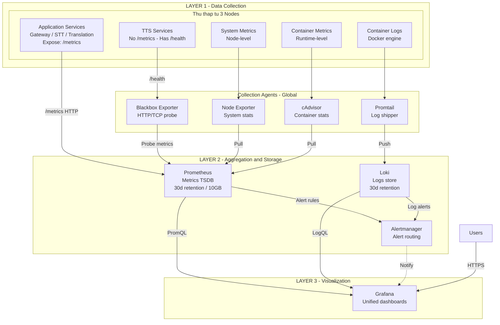

# Đánh Giá Hệ Thống Monitoring - JBCalling Translation System

**Ngày đánh giá**: December 10, 2025  
**Phiên bản**: 1.0  
**Trạng thái**: Production Assessment

---

## 1. Tổng Quan Kiến Trúc Monitoring

### 1.1 Sơ Đồ Kiến Trúc



### 1.2 Thành Phần Monitoring Stack

| Component | Image | Version | Mode | Placement |
|-----------|-------|---------|------|-----------|
| Prometheus | prom/prometheus | v2.54.1 | Replicated (1) | Manager |
| Alertmanager | prom/alertmanager | v0.27.0 | Replicated (1) | Manager |
| Grafana | grafana/grafana | 11.3.0 | Replicated (1) | Manager |
| Loki | grafana/loki | 3.2.1 | Replicated (1) | Manager |
| Promtail | grafana/promtail | 3.2.1 | Global | All nodes |
| Node Exporter | prom/node-exporter | v1.8.2 | Global | All nodes |
| cAdvisor | gcr.io/cadvisor/cadvisor | v0.49.1 | Global | All nodes |
| Redis Exporter | oliver006/redis_exporter | v1.63.0 | Replicated (1) | Manager |
| Blackbox Exporter | prom/blackbox-exporter | v0.25.0 | Replicated (1) | Manager |

---

## 2. Cấu Hình Chi Tiết

### 2.1 Prometheus Configuration

**File**: `infrastructure/swarm/configs/prometheus.yml`

#### Global Settings
```yaml
global:
  scrape_interval: 15s
  evaluation_interval: 15s
  external_labels:
    cluster: 'jbcalling-production'
    env: 'production'
```

#### Scrape Targets

| Job Name | Targets | Metrics Path | Notes |
|----------|---------|--------------|-------|
| `prometheus` | localhost:9090 | /metrics | Self-monitoring |
| `dockerswarm-tasks` | Docker Swarm SD | /metrics | Auto-discovery với label `prometheus_job` |
| `node-exporter` | 10.200.0.5:9100, 10.200.0.6:9100, 10.200.0.8:9100 | /metrics | Static config, 3 nodes |
| `cadvisor` | 10.200.0.5:8080, 10.200.0.6:8080, 10.200.0.8:8080 | /metrics | Container metrics |
| `traefik` | traefik:8080 | /metrics | Reverse proxy metrics |
| `gateway` | gateway:3000 | /metrics | WebRTC Gateway |
| `stt` | stt:8002 | /metrics | Speech-to-Text |
| `translation` | translation:8005 | /metrics | Translation service |
| `tts` | via Blackbox | /probe | HTTP health probe (không có /metrics) |
| `blackbox-external` | jbcalling.site, grafana.*, prometheus.* | /probe | External monitoring |
| `redis` | redis-exporter:9121 | /metrics | Redis metrics |
| `loki` | loki:3100 | /metrics | Log aggregation |
| `grafana` | grafana:3000 | /metrics | Visualization |

#### Storage Configuration
- **Retention Time**: 30 days
- **Retention Size**: 10GB
- **TSDB Path**: `/prometheus`
- **Admin API**: Enabled
- **Lifecycle API**: Enabled

### 2.2 Alertmanager Configuration

**File**: `infrastructure/swarm/configs/alertmanager.yml`

#### Route Configuration
```yaml
route:
  receiver: 'default-receiver'
  group_by: ['alertname', 'service', 'severity']
  group_wait: 30s
  group_interval: 5m
  repeat_interval: 4h
```

#### Alert Routes

| Match | Receiver | Group Wait | Repeat |
|-------|----------|------------|--------|
| severity: critical | critical-alerts | 10s | 1h |
| severity: warning | warning-alerts | 1m | 4h |
| service: stt/translation/tts/gateway | ai-service-alerts | default | default |
| service: traefik/redis/prometheus/grafana | infra-alerts | default | default |

#### Inhibition Rules
1. **NodeDown** suppresses all alerts trên node đó
2. **Critical** suppresses warning của cùng service

#### Receivers (⚠️ Placeholder)
- Tất cả receivers đều dùng webhook tới `localhost:5001` (chưa có server thực)
- SMTP config được comment out (cần cấu hình)

### 2.3 Alert Rules

#### Service Alerts (`service-alerts.yml`)

| Alert | Condition | Severity | For |
|-------|-----------|----------|-----|
| ServiceDown | `up == 0` | critical | 1m |
| ServiceHighLatency | P95 > 2s | warning | 5m |
| ServiceHighErrorRate | Error rate > 5% | warning | 5m |
| ServiceCriticalErrorRate | Error rate > 20% | critical | 2m |
| GatewayDown | `up{job="gateway"} == 0` | critical | 1m |
| GatewayHighConnections | connections > 100 | warning | 5m |
| STTServiceDown | `up{job="stt"} == 0` | critical | 1m |
| STTHighLatency | P95 > 3s | warning | 5m |
| STTCriticalLatency | P95 > 5s | critical | 2m |
| TranslationServiceDown | `up{job="translation"} == 0` | critical | 1m |
| TranslationHighLatency | P95 > 2s | warning | 5m |
| TTSServiceDown | `probe_success{job="tts"} == 0` | critical | 1m |
| TTSServiceSlowResponse | probe duration > 5s | warning | 5m |
| RedisDown | `redis_up == 0` | critical | 1m |
| RedisHighMemoryUsage | > 85% | warning | 5m |
| RedisCriticalMemoryUsage | > 95% | critical | 2m |
| TraefikDown | `up{job="traefik"} == 0` | critical | 1m |
| TraefikCertificateExpiringSoon | < 14 days | warning | 1h |
| ExternalEndpointDown | `probe_success == 0` | critical | 2m |
| SSLCertificateExpiringSoon | < 14 days | warning | 1h |
| SSLCertificateExpired | < 0 days | critical | 0m |

#### Node Alerts (`node-alerts.yml`)

| Alert | Condition | Severity | For |
|-------|-----------|----------|-----|
| NodeDown | `up{job="dockerswarm-nodes"} == 0` | critical | 2m |
| NodeHighCpuUsage | > 85% | warning | 5m |
| NodeCriticalCpuUsage | > 95% | critical | 2m |
| NodeHighMemoryUsage | > 85% | warning | 5m |
| NodeCriticalMemoryUsage | > 95% | critical | 2m |
| NodeDiskSpaceLow | > 80% | warning | 10m |
| NodeDiskSpaceCritical | > 90% | critical | 5m |
| NodeHighNetworkErrors | > 10 err/s | warning | 5m |
| ContainerHighCpuUsage | > 80% | warning | 5m |
| ContainerHighMemoryUsage | > 85% | warning | 5m |
| ContainerOOMKilled | OOM events > 0 | critical | 0m |
| ContainerRestarted | > 3 restarts/hour | warning | 5m |

### 2.4 Loki Configuration

**File**: `infrastructure/swarm/configs/loki-config.yml`

```yaml
# Key settings
auth_enabled: false
server:
  http_listen_port: 3100
  
# Storage
schema_config:
  configs:
    - store: tsdb
      schema: v13
      index:
        period: 24h

# Limits
limits_config:
  reject_old_samples_max_age: 168h  # 7 days
  max_query_series: 5000
  ingestion_rate_mb: 10
  per_stream_rate_limit: 3MB

# Retention (30 days via compactor)
compactor:
  retention_enabled: true
  retention_delete_delay: 2h
```

### 2.5 Promtail Configuration

**File**: `infrastructure/swarm/configs/promtail-config.yml`

#### Scrape Jobs

| Job | Source | Labels | Notes |
|-----|--------|--------|-------|
| docker | Docker SD | container, stack, service, node_id, image | Chỉ scrape stack "translation" |
| system | /var/log/*.log | job=varlogs | System logs |
| journal | /var/log/journal | unit, hostname, level | Systemd journal |

#### Pipeline Stages
- Docker JSON parsing
- Timestamp extraction (RFC3339, Unix)
- Level extraction
- Multiline aggregation cho system logs

### 2.6 Grafana Dashboards

#### Provisioned Datasources
1. **Prometheus** (default) - http://prometheus:9090
2. **Loki** - http://loki:3100
3. **Alertmanager** - http://alertmanager:9093

#### Dashboards

| Dashboard | UID | Description | Panels |
|-----------|-----|-------------|--------|
| Node Overview | jbcalling-nodes | System metrics | CPU, Memory, Disk gauges; CPU/Memory over time; Service health; Network/Disk I/O |
| AI Services | jbcalling-ai-services | AI pipeline metrics | STT/Translation/TTS status, latency, throughput; Gateway metrics; External endpoints |
| Logs Explorer | jbcalling-logs | Log analysis | Error logs, Error rate by service, Log volume; Per-service log panels |

### 2.7 Blackbox Exporter Modules

| Module | Prober | Timeout | Use Case |
|--------|--------|---------|----------|
| http_2xx | HTTP GET | 10s | Basic health check |
| http_health_json | HTTP GET | 10s | TTS /health endpoint |
| http_post | HTTP POST | 15s | API endpoints |
| tcp_connect | TCP | 5s | Port connectivity |
| dns_check | DNS | 5s | DNS resolution |
| icmp_ping | ICMP | 5s | Network ping |
| http_websocket | HTTP | 10s | WebSocket check |

---

## 3. Phân Tích Khoảng Trống & Rủi Ro

### 3.1 ⚠️ Thiếu Sót Cần Khắc Phục

#### 3.1.1 Alert Notification (CRITICAL)
```
❌ Alertmanager receivers đều là placeholder
   - Webhook URLs: localhost:5001 (không tồn tại)
   - SMTP: Comment out, chưa cấu hình
   
📋 Action Required:
   - Cấu hình SMTP cho email alerts
   - Hoặc tích hợp Slack/Telegram webhook
   - Hoặc sử dụng Grafana Unified Alerting
```

#### 3.1.2 Application Metrics Gaps
```
⚠️ Metrics có thể chưa expose hoặc chưa scrape đúng:

Gateway service:
- gateway_active_connections (alert rule dùng nhưng cần verify)
- gateway_webrtc_connection_failures_total
- gateway_rooms_total, gateway_workers_total, gateway_audio_streams_total

STT service:
- stt_transcription_duration_seconds_bucket (histogram)
- stt_transcriptions_total
- stt_model_load_failures_total

Translation service:
- translation_duration_seconds_bucket / translation_latency_seconds_bucket (không nhất quán)
- translation_requests_total{status="success|error"}
- translation_cache_hits_total, translation_cache_misses_total

📋 Action Required:
- Verify từng service có expose metrics đúng
- Kiểm tra Prometheus targets status: https://prometheus.jbcalling.site/targets
```

#### 3.1.3 Docker Daemon Metrics
```
⚠️ Alert DockerDaemonDown tham chiếu job="docker-daemon" nhưng không có scrape config

📋 Action Required:
- Thêm scrape job cho Docker daemon metrics
- Hoặc bỏ alert DockerDaemonDown
```

#### 3.1.4 Recording Rules & Pre-aggregation
```
⚠️ Không có recording rules để pre-compute expensive queries

📋 Recommended:
- Tạo recording rules cho các query phức tạp (P95, error rate)
- Giảm query latency cho dashboards
```

### 3.2 🟡 Cải Thiện Được Khuyến Nghị

#### 3.2.1 Security
- Prometheus/Alertmanager exposed qua Traefik nhưng không có authentication
- Grafana password hardcoded trong stack file (`JBCalling2025!`)
- Cần thêm Basic Auth hoặc OAuth cho các endpoints

#### 3.2.2 High Availability
- Tất cả monitoring components chạy single replica
- Nếu manager node fail → mất monitoring
- Xem xét Prometheus HA với Thanos/Cortex cho production critical

#### 3.2.3 Missing Dashboards
- **Traefik Dashboard**: Request rate, latency, error codes
- **Redis Dashboard**: Commands, memory, connections over time
- **WebRTC Quality Dashboard**: Packet loss, jitter, RTT

### 3.3 🟢 Điểm Mạnh Hiện Tại

| Aspect | Status | Notes |
|--------|--------|-------|
| Full stack coverage | ✅ | Metrics + Logs + Alerts |
| Auto-discovery | ✅ | Docker Swarm SD |
| Retention policy | ✅ | 30 days cho cả metrics và logs |
| SSL monitoring | ✅ | Certificate expiry alerts |
| External monitoring | ✅ | Blackbox probes cho public endpoints |
| Dashboard provisioning | ✅ | Auto-load dashboards on startup |
| Log aggregation | ✅ | Promtail → Loki pipeline |

---

## 4. Kế Hoạch Thử Tải Production

### 4.1 Mục Tiêu SLO (Service Level Objectives)

| Service | Metric | Target | Critical Threshold |
|---------|--------|--------|-------------------|
| Gateway | Availability | 99.9% | < 99% |
| Gateway | P95 Latency | < 500ms | > 2s |
| STT | P95 Latency | < 3s | > 5s |
| Translation | P95 Latency | < 2s | > 3s |
| TTS | Health Response | < 1s | > 5s |
| Traefik | Error Rate | < 1% | > 5% |

### 4.2 Công Cụ Benchmark Đề Xuất

#### 4.2.1 HTTP/API Load Testing

**Tool**: [k6](https://k6.io/) hoặc [wrk](https://github.com/wg/wrk)

```javascript
// k6 script example: stt-loadtest.js
import http from 'k6/http';
import { check, sleep } from 'k6';

export const options = {
  stages: [
    { duration: '2m', target: 10 },   // Ramp-up
    { duration: '5m', target: 50 },   // Sustained load
    { duration: '2m', target: 100 },  // Peak
    { duration: '2m', target: 0 },    // Ramp-down
  ],
  thresholds: {
    http_req_duration: ['p(95)<3000'],  // P95 < 3s
    http_req_failed: ['rate<0.01'],     // Error rate < 1%
  },
};

export default function () {
  const audioPayload = open('./test-audio.wav', 'b');
  const res = http.post('https://stt.jbcalling.site/transcribe', audioPayload, {
    headers: { 'Content-Type': 'audio/wav' },
  });
  check(res, {
    'status is 200': (r) => r.status === 200,
    'has transcript': (r) => r.json().text !== undefined,
  });
  sleep(1);
}
```

#### 4.2.2 WebRTC Load Testing

**Tool**: Custom script với [puppeteer](https://pptr.dev/) + [webrtc-internals](https://webrtc.github.io/samples/)

```javascript
// webrtc-loadtest.js - Puppeteer
const puppeteer = require('puppeteer');

async function simulateCall(roomId, participantId) {
  const browser = await puppeteer.launch({ headless: true });
  const page = await browser.newPage();
  
  // Grant media permissions
  const context = browser.defaultBrowserContext();
  await context.overridePermissions('https://jbcalling.site', ['microphone', 'camera']);
  
  await page.goto(`https://jbcalling.site/room/${roomId}?test=true`);
  
  // Collect WebRTC stats
  const stats = await page.evaluate(async () => {
    // Extract RTCPeerConnection stats
    // Return: bytesReceived, jitter, packetsLost, roundTripTime
  });
  
  return stats;
}

// Run 20 concurrent calls
Promise.all(Array(20).fill().map((_, i) => 
  simulateCall('loadtest-room', `participant-${i}`)
));
```

#### 4.2.3 Redis Load Testing

**Tool**: [redis-benchmark](https://redis.io/docs/management/optimization/benchmarks/)

```bash
# From translation01 (manager node)
docker exec -it $(docker ps -qf "name=translation_redis.1") \
  redis-benchmark -h localhost -p 6379 \
  -c 50 -n 100000 \
  -t get,set,lpush,lpop
```

### 4.3 Kịch Bản Thử Tải

#### Scenario 1: Baseline Load (10 concurrent users)
```yaml
Duration: 10 minutes
Target:
  - 10 concurrent video calls
  - ~20 STT requests/minute
  - ~20 Translation requests/minute
  - ~10 TTS requests/minute
Expected:
  - CPU: < 50%
  - Memory: < 70%
  - All P95 latencies within SLO
```

#### Scenario 2: Normal Peak (50 concurrent users)
```yaml
Duration: 30 minutes
Target:
  - 50 concurrent video calls
  - ~100 STT requests/minute
  - ~100 Translation requests/minute
  - ~50 TTS requests/minute
Expected:
  - CPU: < 80%
  - Memory: < 85%
  - P95 latencies may increase but within critical threshold
```

#### Scenario 3: Stress Test (100+ concurrent users)
```yaml
Duration: 15 minutes
Target:
  - 100+ concurrent video calls
  - ~200 STT requests/minute
  - ~200 Translation requests/minute
  - ~100 TTS requests/minute
Expected:
  - Identify breaking points
  - Observe autoscaling behavior (if configured)
  - Document degradation patterns
```

### 4.4 PromQL Queries cho Thu Thập Kết Quả

#### System Metrics
```promql
# CPU Usage by Node
100 - (avg by(instance) (rate(node_cpu_seconds_total{mode="idle"}[5m])) * 100)

# Memory Usage by Node
(1 - (node_memory_MemAvailable_bytes / node_memory_MemTotal_bytes)) * 100

# Disk I/O
rate(node_disk_read_bytes_total[5m])
rate(node_disk_written_bytes_total[5m])
```

#### Service Metrics
```promql
# STT P95 Latency
histogram_quantile(0.95, sum(rate(stt_transcription_duration_seconds_bucket[5m])) by (le))

# STT Throughput
rate(stt_transcriptions_total[5m])

# Translation P95 Latency
histogram_quantile(0.95, sum(rate(translation_latency_seconds_bucket[5m])) by (le))

# Translation Cache Hit Rate
rate(translation_cache_hits_total[5m]) / (rate(translation_cache_hits_total[5m]) + rate(translation_cache_misses_total[5m]))

# Gateway Active Connections
gateway_active_connections

# Gateway Rooms
gateway_rooms_total
```

#### Error Rates
```promql
# Service Error Rate
sum by(job) (rate(http_requests_total{status=~"5.."}[5m])) 
/ sum by(job) (rate(http_requests_total[5m])) * 100

# Traefik Error Rate
sum(rate(traefik_service_requests_total{code=~"5.."}[5m])) 
/ sum(rate(traefik_service_requests_total[5m])) * 100
```

### 4.5 Checklist Vận Hành Thử Tải

#### Trước Khi Test
- [ ] Verify tất cả services đang healthy
- [ ] Check Prometheus targets: https://prometheus.jbcalling.site/targets
- [ ] Check disk space availability (> 20% free)
- [ ] Thông báo team về thời gian test
- [ ] Backup Prometheus snapshot nếu cần:
  ```bash
  curl -X POST https://prometheus.jbcalling.site/api/v1/admin/tsdb/snapshot
  ```
- [ ] Tắt/silence non-critical alerts trong Alertmanager
- [ ] Chuẩn bị test data (audio files, API payloads)

#### Trong Khi Test
- [ ] Monitor Grafana dashboards real-time
- [ ] Watch for alert firing
- [ ] Record timestamps của các milestones (ramp-up, peak, issues)
- [ ] Capture screenshots/recordings của dashboards

#### Sau Khi Test
- [ ] Export metrics snapshot
- [ ] Query Prometheus cho period test:
  ```promql
  # Example: Get all metrics for last 30 minutes
  {__name__=~".+"} [30m]
  ```
- [ ] Download Loki logs cho analysis:
  ```bash
  # Via Grafana Explore or LogCLI
  logcli query '{job=~".+"}' --from="2025-12-10T10:00:00Z" --to="2025-12-10T10:30:00Z" --output=jsonl > loadtest-logs.jsonl
  ```
- [ ] Generate report với:
  - Peak metrics values
  - Error patterns
  - Bottleneck identification
  - Scaling recommendations

### 4.6 Tiêu Chí Đánh Giá Scale-Up

| Metric | Scale Trigger | Action |
|--------|---------------|--------|
| CPU > 80% sustained 5m | Scale horizontally | Add replicas hoặc node |
| Memory > 85% sustained 5m | Scale vertically | Increase limits/node memory |
| P95 Latency > SLO 2x | Investigate bottleneck | Profile, optimize, or scale |
| Error Rate > 5% | Immediate action | Rollback hoặc hotfix |
| Gateway connections > 80 | Scale Gateway | Add replicas, distribute load |
| Redis memory > 90% | Scale Redis | Increase maxmemory, consider cluster |
| Disk usage > 80% | Cleanup or expand | Prune old data, add storage |

---

## 5. Action Items Ưu Tiên

### High Priority (P0)
1. **Cấu hình Alert Notification thực**
   - Chọn: Email (SMTP) hoặc Slack/Telegram webhook
   - Cập nhật `alertmanager.yml`
   - Test alert flow end-to-end

2. **Verify Application Metrics**
   - Check từng service có expose metrics đúng
   - Fix metric names không nhất quán (translation_duration vs translation_latency)

### Medium Priority (P1)
3. **Thêm Authentication cho Prometheus/Alertmanager**
   - Traefik Basic Auth middleware
   - Hoặc OAuth2 proxy

4. **Tạo Recording Rules**
   - Pre-compute expensive queries
   - Improve dashboard performance

### Low Priority (P2)
5. **Thêm Dashboards**
   - Traefik detailed dashboard
   - Redis detailed dashboard
   - WebRTC quality dashboard

6. **Consider HA Setup**
   - Prometheus với Thanos sidecar
   - Loki với S3 backend

---

## 6. Appendix

### A. File Locations

| Component | Config File |
|-----------|-------------|
| Stack definition | `infrastructure/swarm/stack-hybrid.yml` |
| Prometheus config | `infrastructure/swarm/configs/prometheus.yml` |
| Alertmanager config | `infrastructure/swarm/configs/alertmanager.yml` |
| Service alerts | `infrastructure/swarm/configs/prometheus-rules/service-alerts.yml` |
| Node alerts | `infrastructure/swarm/configs/prometheus-rules/node-alerts.yml` |
| Loki config | `infrastructure/swarm/configs/loki-config.yml` |
| Promtail config | `infrastructure/swarm/configs/promtail-config.yml` |
| Blackbox config | `infrastructure/swarm/configs/blackbox.yml` |
| Grafana datasources | `infrastructure/swarm/configs/grafana/provisioning/datasources/datasources.yml` |
| Grafana dashboards | `infrastructure/swarm/configs/grafana/dashboards/*.json` |
| Deploy script | `scripts/deploy-monitoring.sh` |

### B. Access URLs

| Service | URL |
|---------|-----|
| Grafana | https://grafana.jbcalling.site |
| Prometheus | https://prometheus.jbcalling.site |
| Alertmanager | https://alertmanager.jbcalling.site |
| Main App | https://jbcalling.site |

### C. Useful Commands

```bash
# Check monitoring services status
docker service ls | grep -E "prometheus|grafana|loki|alertmanager|exporter"

# View Prometheus logs
docker service logs translation_prometheus --tail 100 -f

# Reload Prometheus config
curl -X POST https://prometheus.jbcalling.site/-/reload

# Check active alerts
curl https://prometheus.jbcalling.site/api/v1/alerts

# Query Prometheus
curl 'https://prometheus.jbcalling.site/api/v1/query?query=up'

# Check Alertmanager alerts
curl https://alertmanager.jbcalling.site/api/v2/alerts
```

---

*Document generated: December 10, 2025*


