# System Architecture Design (SAD) - JBCalling Translation System

**Date**: December 02, 2025  
**Version**: 1.0  
**Status**: Active  
**Authors**: Hoanh Hop

---

## 1. Executive Summary

Hệ thống JBCalling Translation là một nền tảng videocall với dịch thuật thời gian thực đa ngôn ngữ. Hệ thống được triển khai trên Google Cloud Platform sử dụng Docker Swarm cluster với 3 nodes, không sử dụng GPU.

### Các tính năng chính:
- **WebRTC Videocall**: Sử dụng MediaSoup SFU (TypeScript)
- **Speech-to-Text (STT)**: Sherpa-ONNX với **2 models**:
  - Vietnamese: `sherpa-onnx-zipformer-vi-int8` (Offline mode)
  - English: `sherpa-onnx-streaming-zipformer-en` (Online streaming mode)
- **Translation**: VinAI CTranslate2 INT8 với **2 models**:
  - `vi2en`: Vietnamese → English
  - `en2vi`: English → Vietnamese
- **Text-to-Speech (TTS)**: Piper TTS với **2 voice models**:
  - Vietnamese: `vi_VN-vais1000-medium`
  - English: `en_US-lessac-medium`
- **Real-time Processing**: Socket.IO + Redis pub/sub

---

## 2. System Overview Diagram

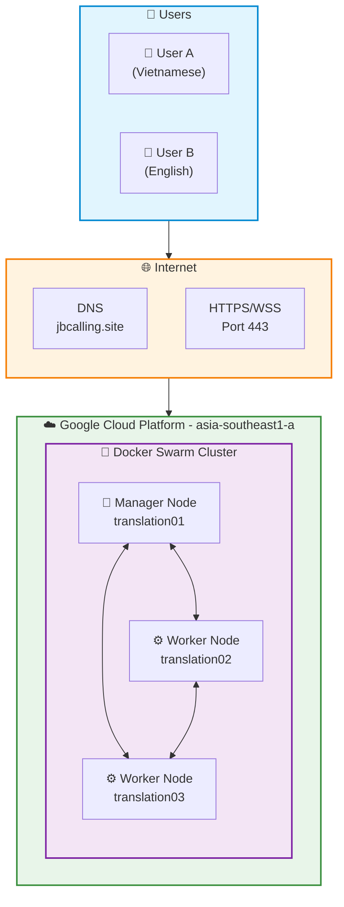

---

## 3. Infrastructure Architecture

### 3.1 Docker Swarm Cluster Topology

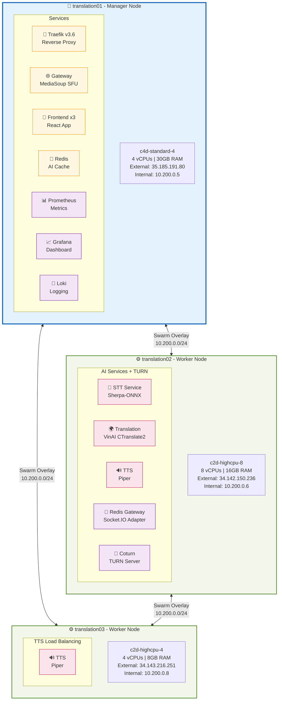

### 3.2 Network Architecture

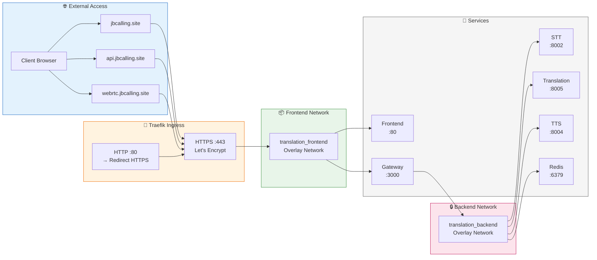

### 3.3 Netflix-Style Microservices Architecture

Sơ đồ kiến trúc microservices theo phong cách Netflix cho hệ thống **JB Calling – Video Call dịch song ngữ tích hợp vào nền tảng Hommy**.

```mermaid
---
config:
  layout: elk
---
flowchart TB
  %% ===== HOMMY PLATFORM (Nền tảng chính - Cho thuê trọ) =====
  subgraph Hommy_Platform["🏠 HOMMY PLATFORM - Nền tảng cho thuê trọ"]
    direction TB
    subgraph Hommy_Users["Người dùng Hommy"]
      direction LR
      Tenant["🏠 Tenant`<br>`(Người thuê)"]
      Landlord["🏢 Landlord`<br>`(Chủ nhà)"]
      Sales["👔 Sales Staff`<br>`(Nhân viên Hommy)"]
    end
    subgraph Hommy_Services["Dịch vụ Hommy"]
      direction LR
      Hommy_Web["🌐 Hommy Web App`<br>`daphongtro.dev (DevTunnel)"]
      Hommy_Mobile["📱 Hommy Mobile`<br>`(coming soon)"]
      Hommy_API["⚡ Hommy API`<br>`Backend Services"]
    end
  end

  %% ===== HOMMY DEV INFRA (daphongtro + DevTunnels) =====
  subgraph Hommy_Dev["🖥️ HOMMY DEV INFRA - VS Code DevTunnels"]
    direction TB
    subgraph DevTunnels["DevTunnel Forwarders (.asse.devtunnels.ms)"]
      Tunnel5173["🔐 {id}-5173 → Vite dev server`<br>`HTTPS proxy :5173"]
      Tunnel5000["🔐 {id}-5000 → Express API + Socket.IO`<br>`HTTPS + WSS proxy :5000"]
    end
    subgraph DevMachine["Máy dev Windows + VS Code"]
      direction TB
      VSCode["VS Code + DevTunnel CLI`<br>`npm run dev & npm start"]
      subgraph Frontend_Dev["Frontend (client/)"]
        direction TB
        Vite["Vite dev server :5173`<br>`React + TanStack Query"]
        MapLeaflet["react-leaflet + Leaflet`<br>`Bản đồ chi tiết tin đăng"]
        ChatWidget["ChatBot component`<br>`Trang chủ Hommy"]
      end
      subgraph Backend_Dev["Backend (server/)"]
        direction TB
        Express["Express REST API + Socket.IO`<br>`Port 5000"]
        Routes["Routes: /api/chu-du-an, /api/chat`<br>`/api/geocode, /api/chatbot"]
        CronJobs["node-cron jobs`<br>`appointment reminders/report"]
        SepaySync["SepaySyncService`<br>`Poll giao dịch 60s"]
      end
      subgraph DataLayer["Tầng dữ liệu nội bộ"]
        MySQL["MySQL (XAMPP)`<br>`Database thue_tro"]
        Uploads["Static /uploads`<br>`Ảnh phòng & tài liệu"]
      end
    end
    subgraph Hommy_External["Dịch vụ ngoài (Hommy)"]
      direction TB
      Sepay["Sepay Banking API`<br>`https://my.sepay.vn"]
      OSMTiles["OpenStreetMap Tiles`<br>`https://{s}.tile.openstreetmap.org"]
      Nominatim["Nominatim Geocoding API`<br>`openstreetmap.org"]
      Groq["Groq Chat Completion API`<br>`llama-3.3-70b-versatile"]
    end
  end

  %% ===== DNS & CDN LAYER =====
  subgraph DNS_CDN["🌐 DNS & CDN LAYER (JB Calling)"]
    direction TB
    subgraph Hostinger_DNS["Hostinger DNS Management"]
      DNS_JB["📍 jbcalling.site DNS`<br>`A + AAAA Records`<br>`(IPv4/IPv6 Dual Stack)"]
      DNS_Subdomains["📍 Subdomains`<br>`webrtc/stt/translation/tts/grafana.jbcalling.site"]
    end
    subgraph Cache_Layer["⚡ Caching Strategy"]
      Nginx_Cache["Nginx Static Cache`<br>`no-store, no-cache`<br>`(Real-time App)"]
      Redis_TTL["Redis TTL Cache`<br>`Translation: 24h`<br>`Session: 1h"]
    end
  end

  %% ===== GOOGLE CLOUD PLATFORM =====
  subgraph GCP["☁️ GOOGLE CLOUD PLATFORM - asia-southeast1-a"]
    direction TB
    subgraph JB_Calling["📞 JB CALLING - Video Call Dịch Song Ngữ"]
      direction TB
      subgraph Gateway_Layer["🔀 API GATEWAY + MONITORING - translation01 (c2d-highmem-4)"]
        direction TB
        Traefik["🚦 Traefik v3.6`<br>`Reverse Proxy + LB`<br>`Let's Encrypt SSL :80/:443"]
        Gateway["🌐 Gateway Service`<br>`TypeScript + Socket.IO`<br>`MediaSoup SFU :3000 + UDP 40000-40019"]
        Frontend["📱 Frontend x3 (VIP LB)`<br>`React + Nginx :80"]
        subgraph Monitoring_Stack["📊 Monitoring Stack"]
          Prometheus["📈 Prometheus :9090"]
          Grafana["📊 Grafana :3000`<br>`grafana.jbcalling.site"]
          Loki["📝 Loki :3100"]
        end
        Redis["💾 Redis Cache :6379`<br>`AI Result Caching"]
      end
      subgraph Media_Layer["📡 WEBRTC MEDIA LAYER - translation02"]
        direction TB
        MediaSoup["📹 MediaSoup SFU`<br>`2 Workers`<br>`UDP 40000-40019"]
        Coturn["🔄 Coturn TURN`<br>`:3478 / :5349`<br>`UDP 49152-49156"]
      end
      subgraph AI_Pipeline["🤖 AI TRANSLATION PIPELINE - translation02 (c2d-highmem-4)"]
        direction TB
        subgraph STT_Service["🎤 STT Service"]
          STT["Sherpa-ONNX :8002"]
          STT_VI["🇻🇳 VI Offline`<br>`zipformer-vi-int8"]
          STT_EN["🇺🇸 EN Streaming`<br>`zipformer-en"]
        end
        subgraph Trans_Service["🌍 Translation Service"]
          Translation["CTranslate2 INT8 :8005"]
          VI2EN["🇻🇳→🇺🇸 vi2en"]
          EN2VI["🇺🇸→🇻🇳 en2vi"]
        end
        TTS02["🔊 TTS Piper :8004"]
        RedisGW["💾 Redis Gateway :6379`<br>`Socket.IO Adapter"]
      end
      subgraph TTS_LB["🔊 TTS LOAD BALANCING - translation03 (c2d-highmem-4)"]
        direction TB
        TTS03["🔊 TTS Piper :8004`<br>`(Standby - 0/1 replicas)"]
        TTS_Note["⚠️ Currently disabled`<br>`Enable for TTS scaling"]
      end
      subgraph TTS_Models["🎵 Voice Models"]
        TTS_VI["🇻🇳 vi_VN-vais1000"]
        TTS_EN["🇺🇸 en_US-lessac"]
      end
    end
  end

  %% ===== CONNECTIONS =====
  Hommy_Users --> Hommy_Services

  %% Hommy Web/App ↔ DevTunnels & Backend cục bộ
  Hommy_Services -->|"HTTPS"| DevTunnel5173
  DevTunnel5173 -->|"Proxy :5173"| Vite
  Vite -->|"REST + Socket.IO client"| DevTunnel5000
  DevTunnel5000 -->|"Proxy :5000"| Express
  Express -->|"CRUD dữ liệu"| MySQL
  Express -->|"Serve static uploads"| Uploads

  %% Geocoding & bản đồ (Hommy)
  Express -->|"Forward /api/geocode"| Nominatim
  MapLeaflet -->|"Tải tile"| OSMTiles

  %% Chatbot (Hommy ↔ Groq)
  ChatWidget -->|"POST /api/chatbot"| Express
  Express -->|"LLM completions"| Groq

  %% Sepay Banking (Hommy)
  SepaySync -->|"GET /userapi/transactions/list"| Sepay
  SepaySync -->|"Ghi ledger"| MySQL

  %% Hommy → JB Calling Integration (iframe/SDK)
  ChatUI["💬 Chat & Video Call UI`<br>`(Hommy Web)"]
  Hommy_Web --> ChatUI
  ChatUI ==>|"Open JB Calling URL`<br>`https://jbcalling.site/room/:roomId?data=..."| DNS_JB
  DNS_JB -->|"DNS Resolve"| Traefik
  DNS_Subdomains -->|"DNS Resolve"| Traefik
  
  %% Load Balancing Flow
  Traefik -.->|"VIP Load Balance (x3)"| Frontend
  Traefik -.->|"WebSocket Sticky"| Gateway
  
  %% Cache Flow
  Frontend -->|"Static (no-cache)"| Nginx_Cache
  Translation -->|"Cache Hit/Miss"| Redis_TTL
  
  Gateway -->|"RTP/SRTP"| MediaSoup
  MediaSoup -->|"ICE Relay"| Coturn
  Gateway ==>|"PCM 48kHz"| STT
  STT --> STT_VI & STT_EN
  STT ==>|"Text"| Translation
  Translation --> VI2EN & EN2VI
  Translation ==>|"Translated"| TTS02
  TTS02 --> TTS_VI & TTS_EN
  TTS02 ==>|"Audio+Caption"| Gateway
  Gateway -->|"Pub/Sub"| RedisGW
  STT -->|"Cache"| Redis
  Translation -->|"Cache"| Redis
  Gateway -.->|"Metrics"| Prometheus
  STT -.->|"Metrics"| Prometheus
  Translation -.->|"Metrics"| Prometheus
  Prometheus --> Grafana
  Gateway -.->|"Logs"| Loki
  Loki --> Grafana

  %% ===== STYLING =====
  classDef hommy fill:#E8F5E9,stroke:#1B5E20,stroke-width:3px
  classDef dns fill:#E3F2FD,stroke:#0D47A1,stroke-width:2px
  classDef cdn fill:#FFF8E1,stroke:#FF6F00,stroke-width:2px
  classDef gcp fill:#FCE4EC,stroke:#880E4F,stroke-width:3px
  classDef jbcalling fill:#F3E5F5,stroke:#4A148C,stroke-width:2px
  classDef gateway fill:#FFF3E0,stroke:#E65100,stroke-width:2px
  classDef media fill:#E0F2F1,stroke:#00695C,stroke-width:2px
  classDef ai fill:#FCE4EC,stroke:#C2185B,stroke-width:2px
  classDef data fill:#EDE7F6,stroke:#512DA8,stroke-width:2px
  classDef model fill:#FFFDE7,stroke:#F9A825,stroke-width:1px
  classDef devinfra fill:#FFF3E0,stroke:#E65100,stroke-width:2px
  classDef externalhommy fill:#FCE4EC,stroke:#C2185B,stroke-width:2px
  classDef standby fill:#FFEBEE,stroke:#C62828,stroke-width:1px,stroke-dasharray:5

  class Hommy_Platform hommy
  class Hommy_Dev,DevTunnels,DevMachine,Frontend_Dev,Backend_Dev devinfra
  class Hommy_External,Sepay,OSMTiles,Nominatim,Groq externalhommy
  class DNS_CDN,Hostinger_DNS dns
  class Cache_Layer cdn
  class GCP gcp
  class JB_Calling jbcalling
  class Gateway_Layer gateway
  class Media_Layer media
  class AI_Pipeline ai
  class TTS_LB standby
  class STT_VI,STT_EN,VI2EN,EN2VI,TTS_VI,TTS_EN model


```

#### Chú thích các thành phần kiến trúc:

| Thành phần | Mô tả | Công nghệ |
|------------|-------|-----------|
| **🏠 Hommy Platform** | Nền tảng cho thuê trọ chính, tích hợp JB Calling qua iframe/SDK | daphongtro.dev |
| **📍 Hostinger DNS** | Quản lý DNS cho domain jbcalling.site và các subdomains | A + AAAA (IPv4/IPv6 Dual Stack) |
| **⚡ Caching Strategy** | Nginx no-cache (real-time), Redis TTL cache (translation 24h) | Nginx 1.29.3 + Redis 7 |
| **☁️ Google Cloud Platform** | Docker Swarm cluster 3 nodes, c2d-highmem-4 (4 vCPUs, 32GB) | asia-southeast1-a |
| **📞 JB Calling** | Hệ thống Video Call dịch song ngữ - Microservices độc lập | Docker Swarm VIP LB |

#### Chú thích các luồng kết nối:

| Kiểu đường | Ý nghĩa | Mô tả |
|------------|---------|-------|
| `==>` (nét đậm đôi) | Integration Flow | Hommy → JB Calling API Integration |
| `-.->` (nét đứt) | Signaling Flow | HTTP/HTTPS/WebSocket - Điều khiển, báo hiệu |
| `-->` (nét liền) | Media/Data Flow | RTP/SRTP, DNS Resolution, Cache |
| `==>` (nét đậm) | AI Pipeline Flow | Dữ liệu qua pipeline STT→Translation→TTS |

#### Load Balancing & Caching:

| Component | Strategy | Configuration |
|-----------|----------|---------------|
| **Frontend** | Docker Swarm VIP (3 replicas) | Round-robin tự động qua overlay network |
| **Gateway WebSocket** | Sticky Session | Redis adapter cho Socket.IO multi-instance |
| **TTS Services** | Manual scaling | TTS02 active, TTS03 standby (0/1) |
| **Static Assets** | No-cache | `cache-control: no-store, no-cache` (real-time app) |
| **Translation Cache** | Redis TTL | 24h TTL cho sentences đã dịch |

#### DNS Records (Hostinger):

| Domain | Type | Value | Mục đích |
|--------|------|-------|----------|
| jbcalling.site | A | `<EXTERNAL_IPV4>` | IPv4 (GCP External) |
| jbcalling.site | AAAA | `<EXTERNAL_IPV6>` | IPv6 Dual Stack |
| webrtc.jbcalling.site | CNAME | jbcalling.site | Gateway WebSocket |
| stt.jbcalling.site | CNAME | jbcalling.site | STT Service API |
| translation.jbcalling.site | CNAME | jbcalling.site | Translation API |
| tts.jbcalling.site | CNAME | jbcalling.site | TTS Service API |
| grafana.jbcalling.site | CNAME | jbcalling.site | Monitoring Dashboard |

#### Chi tiết Node Placement (GCP) - Thực tế:

| Service | Node | Machine Type | Trạng thái |
|---------|------|--------------|------------|
| Traefik, Gateway, Frontend x3, Redis, Prometheus, Grafana, Loki | **translation01** | c2d-highmem-4 (4 vCPUs, 32GB) | ✅ Running |
| STT, Translation, TTS_02, Redis Gateway, Coturn | **translation02** | c2d-highmem-4 (4 vCPUs, 32GB) | ✅ Running |
| TTS_03 (standby) | **translation03** | c2d-highmem-4 (4 vCPUs, 32GB) | ⏸️ 0/1 replicas |

### 3.4 Domain Model per Microservice (Bounded Context)

Sơ đồ này thể hiện **Domain-Driven Design (DDD)** với các Bounded Context cho từng microservice trong hệ thống JBCalling Translation:

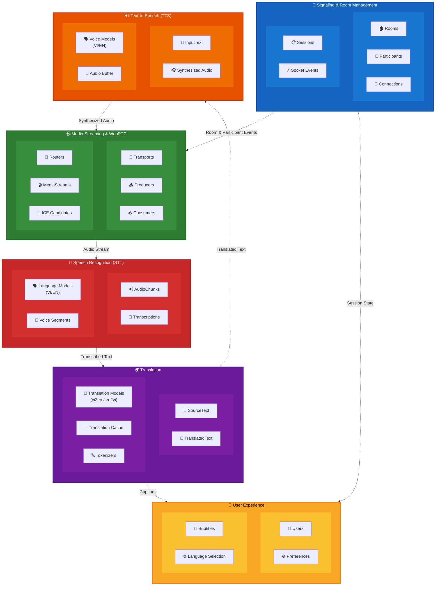

#### Giải thích các Bounded Context:

| Bounded Context | Microservice | Domain Entities | Trách nhiệm |
|-----------------|--------------|-----------------|-------------|
| **📡 Signaling & Room** | Gateway Service | Rooms, Participants, Sessions, Connections, Socket Events | Quản lý phòng họp, người tham gia, kết nối Socket.IO |
| **📹 Media Streaming** | Gateway + MediaSoup | Transports, Producers, Consumers, Routers, MediaStreams, ICE | Xử lý WebRTC media, SFU routing |
| **🎤 Speech Recognition** | STT Service | AudioChunks, Transcriptions, LanguageModels, VoiceSegments | Chuyển audio thành text (VI/EN) |
| **🌍 Translation** | Translation Service | SourceText, TranslatedText, TransModels, Cache, Tokenizers | Dịch vi↔en với cache |
| **🔊 Text-to-Speech** | TTS Service | InputText, SynthesizedAudio, VoiceModels, AudioBuffer | Tổng hợp giọng nói (VI/EN) |
| **👤 User Experience** | Frontend | Users, Preferences, Subtitles, LanguageSelection | Hiển thị UI, phụ đề, cài đặt |

#### Nguyên tắc Bounded Context:

1. **Loose Coupling**: Mỗi context giao tiếp qua API/Events, không phụ thuộc trực tiếp
2. **High Cohesion**: Các entity trong cùng context có liên quan chặt chẽ
3. **Single Responsibility**: Mỗi context chịu trách nhiệm một domain cụ thể
4. **Ubiquitous Language**: Thuật ngữ nhất quán trong mỗi context (AudioChunk, Transcription, Translation...)

### 3.5 API Gateway Pattern

Sơ đồ thể hiện pattern **API Gateway** trong hệ thống JBCalling Translation, nơi Traefik đóng vai trò là điểm vào duy nhất cho tất cả requests:

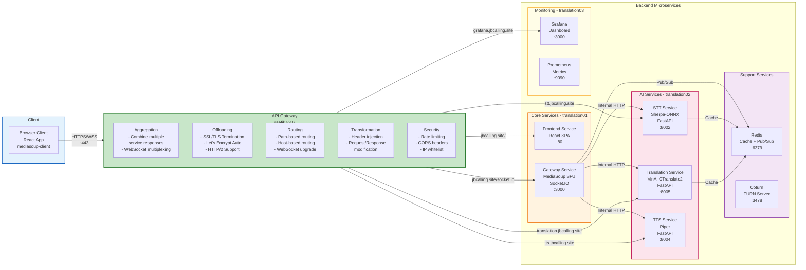

#### Chức năng của API Gateway (Traefik):

| Chức năng | Mô tả | Implementation |
|-----------|-------|----------------|
| **Aggregation** | Gộp responses từ nhiều services, multiplexing WebSocket | Socket.IO routing tới Gateway |
| **Offloading** | SSL/TLS termination, giảm tải crypto cho backend | Let's Encrypt auto-renewal |
| **Routing** | Điều hướng request dựa trên path/host | Path rules, Host rules |
| **Transformation** | Thay đổi headers, rewrite URLs | Middleware chain |
| **Security** | Rate limiting, CORS, authentication | Traefik middlewares |

#### Routing Rules:

| Domain/Path | Target Service | Port | Protocol |
|-------------|----------------|------|----------|
| `jbcalling.site/` | frontend | 80 | HTTP |
| `jbcalling.site/socket.io` | gateway | 3000 | WebSocket |
| `stt.jbcalling.site/*` | stt | 8002 | HTTP |
| `translation.jbcalling.site/*` | translation | 8005 | HTTP |
| `tts.jbcalling.site/*` | tts | 8004 | HTTP |
| `grafana.jbcalling.site/*` | grafana | 3000 | HTTP |

#### Lợi ích của API Gateway Pattern:

1. **Single Entry Point**: Client chỉ cần biết một endpoint duy nhất
2. **SSL Termination**: Chỉ cần quản lý SSL ở gateway, internal traffic có thể dùng HTTP
3. **Cross-cutting Concerns**: Logging, metrics, rate limiting tập trung tại một điểm
4. **Service Discovery**: Gateway tự động phát hiện services qua Docker Swarm DNS
5. **Load Balancing**: Phân tải tự động cho các replicas

---

## 4. Service Communication Diagram

### 4.1 Request Flow

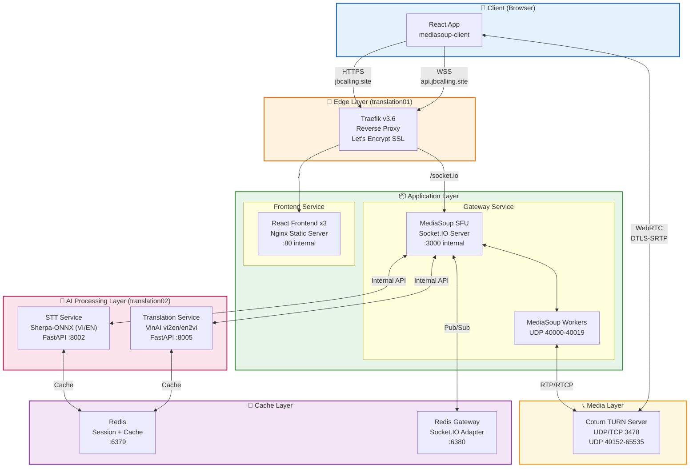

### 4.2 Domain Routing

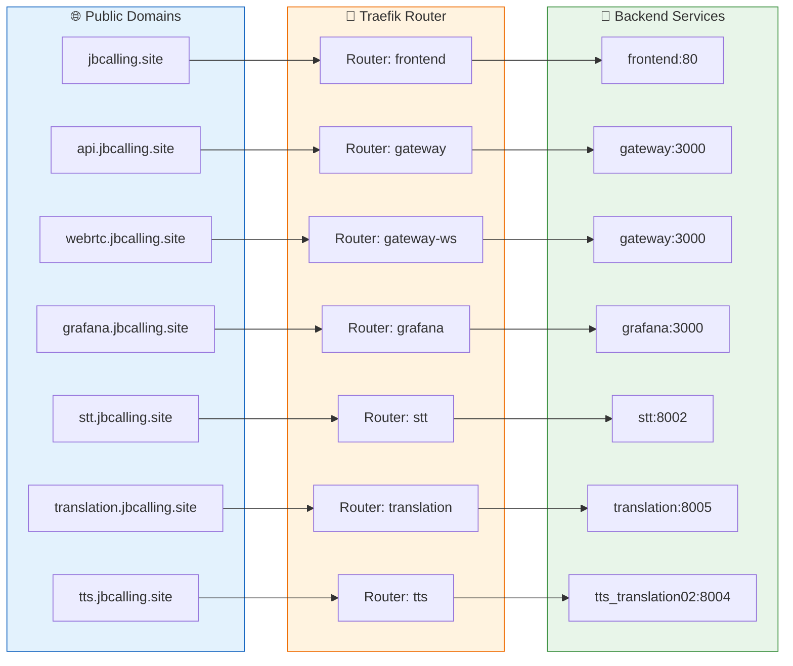

---

## 5. Data Flow Architecture

### 5.1 Bidirectional Translation Flow

Hệ thống hỗ trợ dịch **hai chiều** giữa Tiếng Việt và Tiếng Anh:

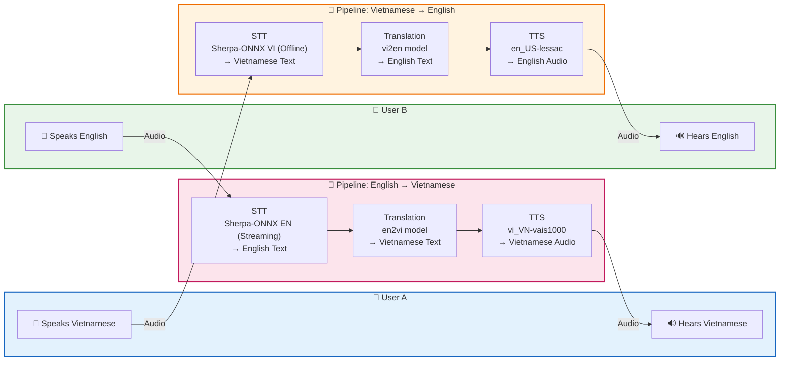

### 5.2 Real-time Translation Pipeline

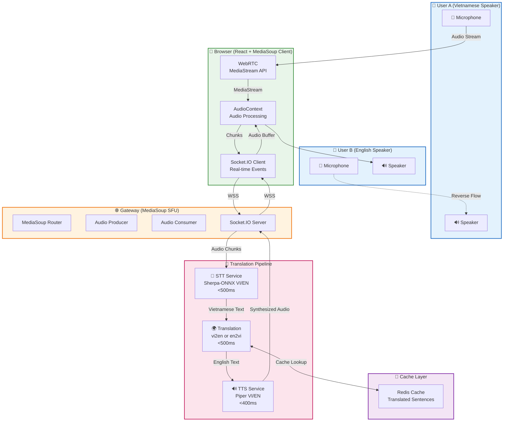

### 5.3 Sequence Diagram - Translation Flow

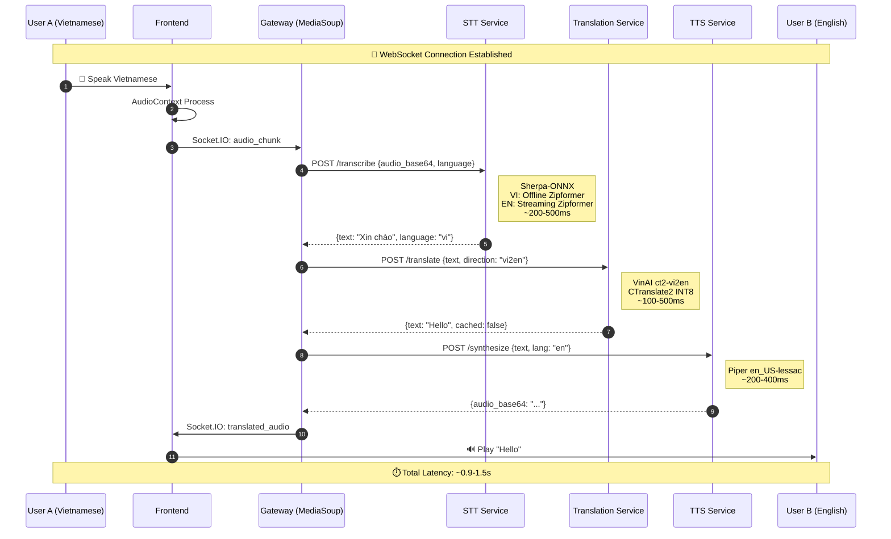

---

## 6. Component Architecture

### 6.1 Frontend Architecture (React)

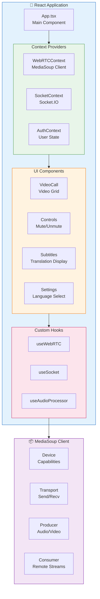

### 6.2 Gateway Architecture (MediaSoup SFU)

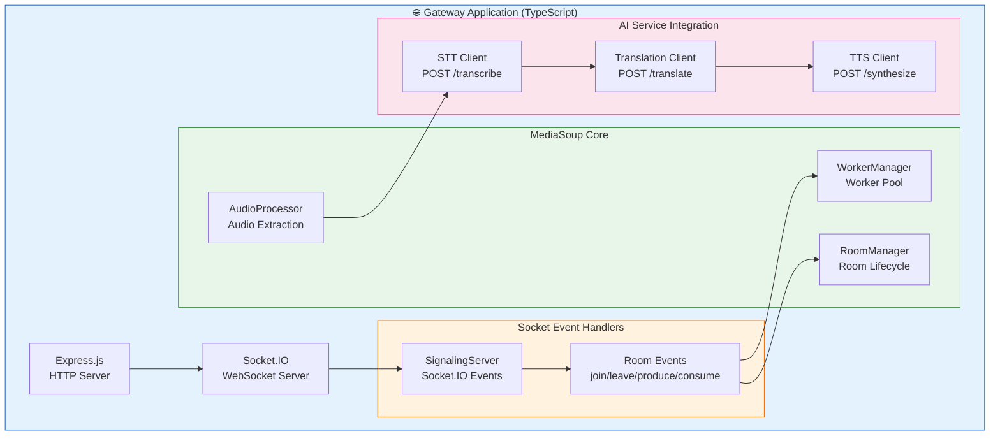

### 6.3 AI Services Architecture

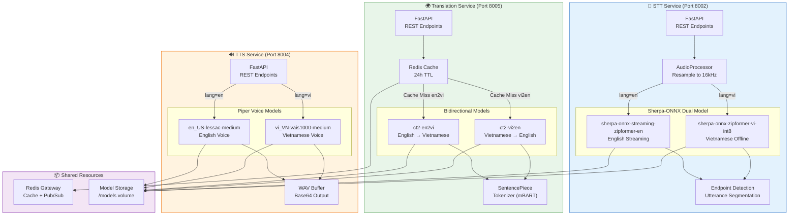

---

## 7. Deployment Architecture

### 7.1 Docker Stack Deployment

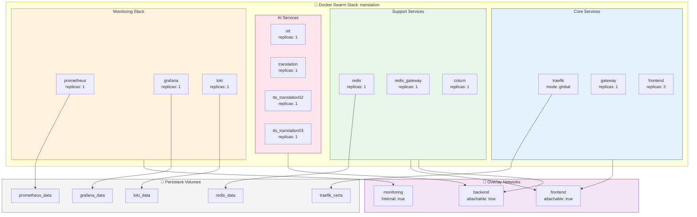

### 7.2 Node Placement Constraints

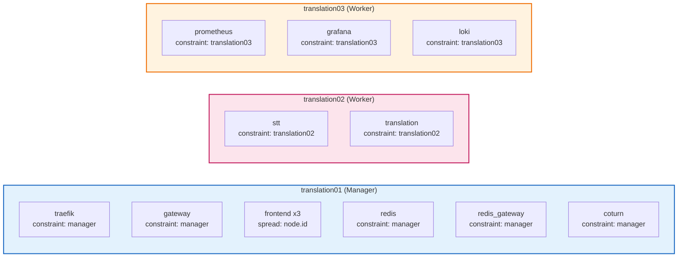

---

## 8. Security Architecture

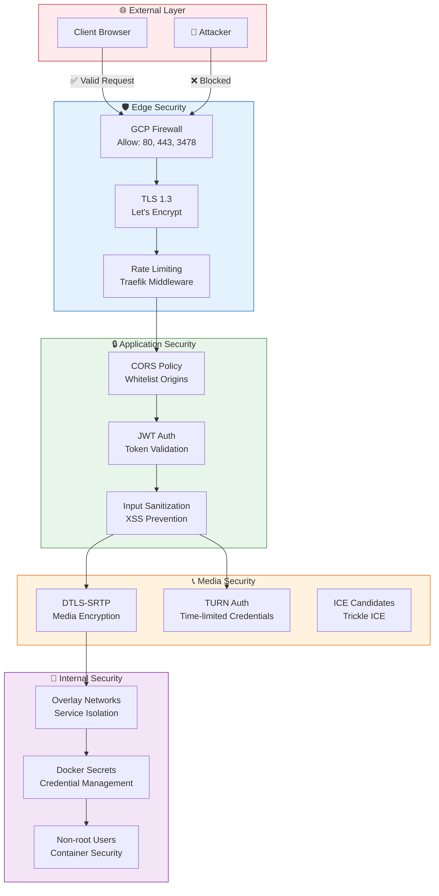

---

## 9. Monitoring Architecture

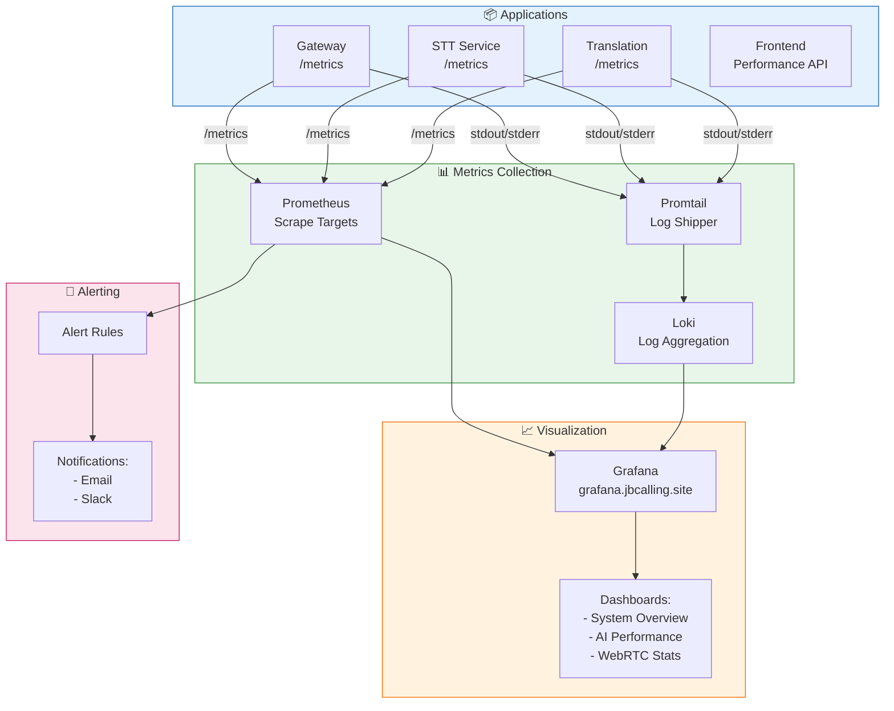

---

## 10. Performance Metrics

### 10.1 Latency Budget

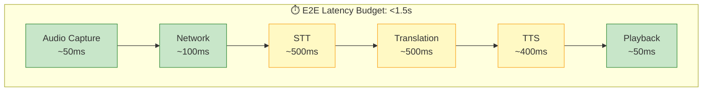

### 10.2 Resource Allocation

| Node | CPU | Memory | Services | Expected Usage |
|------|-----|--------|----------|----------------|
| translation01 | 4 vCPUs | 30GB | Traefik, Gateway, Frontend, Redis, Coturn | CPU: 40-60%, Mem: 8-12GB |
| translation02 | 8 vCPUs | 16GB | STT, Translation | CPU: 60-80%, Mem: 10-14GB |
| translation03 | 4 vCPUs | 8GB | Prometheus, Grafana, Loki | CPU: 20-40%, Mem: 4-6GB |

---

## 11. Appendix

### A. Port Reference

| Service | Internal Port | External Port | Protocol |
|---------|---------------|---------------|----------|
| Traefik | 80, 443, 8080 | 80, 443 | HTTP/HTTPS |
| Frontend | 80 | - | HTTP |
| Gateway | 3000 | - | HTTP/WS |
| STT | 8002 | - | HTTP |
| Translation | 8005 | - | HTTP |
| TTS (translation02) | 8004 | - | HTTP |
| TTS (translation03) | 8004 | - | HTTP |
| Redis | 6379, 6380 | - | TCP |
| Coturn | 3478 | 3478 | UDP/TCP |
| MediaSoup | 40000-40019 | 40000-40019 | UDP |
| Prometheus | 9090 | - | HTTP |
| Grafana | 3000 | - | HTTP |

### B. Technology Stack Summary

| Layer | Technology | Version | Purpose |
|-------|------------|---------|---------|
| Orchestration | Docker Swarm | 29.1.1 | Container Management |
| Reverse Proxy | Traefik | v3.6 | SSL Termination, Routing |
| Frontend | React | 18.x | User Interface |
| WebRTC | MediaSoup | 3.x | SFU Media Server |
| STT | Sherpa-ONNX (VI offline + EN streaming) | Zipformer INT8 | Vietnamese + English Speech Recognition |
| Translation | VinAI vi2en + en2vi | CTranslate2 INT8 | Bidirectional VI↔EN Translation |
| TTS | Piper (vi_VN + en_US) | medium ONNX | Vietnamese + English Voice Synthesis |
| Cache | Redis | 7.x | Caching, Pub/Sub |
| Monitoring | Prometheus/Grafana | - | Metrics/Visualization |

---

**Document History:**
- v1.0 (2025-12-02): Initial SAD document with Mermaid diagrams
